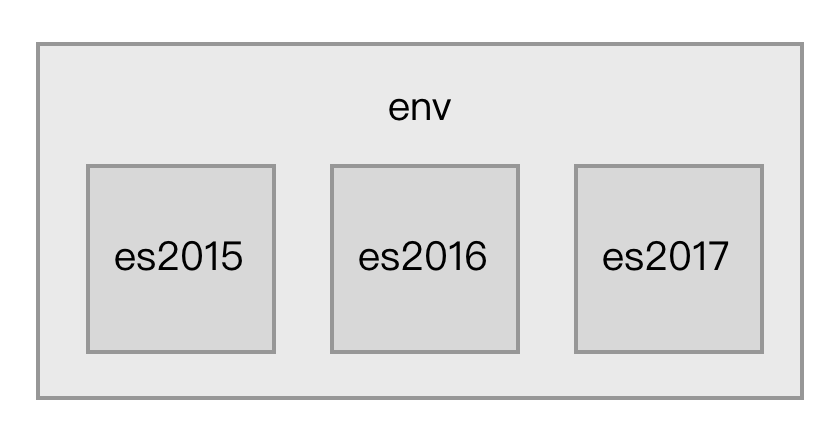

### 使用 ES6 语言
ECMAScript 6.0 是2015年发布的下一代 JavaScript 语言标准，它引入了新的语法和 API 来提升开发效率。
虽然目前部分浏览器和 Node.js 已经支持 ES6，但由于它们对 ES6 所有的标准支持不全，这导致在开发中不敢全面的使用 ES6。

通常我们需要把采用 ES6 编写的代码转换成目前已经支持良好的 ES5 代码，这包含2件事：

1. 把新的 ES6 语法用 ES5 实现，例如 ES6 的 `class` 语法用 ES5 的 `prototype` 实现。
2. 给新的 API 注入 polyfill ，例如使用新的 `fetch` API 时注入对应的 polyfill 后才能让低端浏览器正常运行。

#### Babel
[Babel](https://babeljs.io) 可以方便的完成以上2件事。
Babel 是一个 JavaScript 编译器，能将 ES6 代码转为 ES5 代码让你使用最新的语言特性而不用担心兼容性问题，并且可以通过插件机制根据需求灵活的扩展。
在 Babel 执行编译的过程中，会从项目根目录下的 `.babelrc` 文件读取配置。`.babelrc` 是一个 JSON 格式的文件，内容大致如下：
```json
{
  "plugins": [
    [
      "transform-runtime",
      {
        "polyfill": false
      }
    ]
   ],
  "presets": [
    [
      "es2015",
      {
        "modules": false
      }
    ],
    "stage-2",
    "react"
  ]
}
```

##### Plugins
`plugins` 属性告诉 Babel 要使用哪些插件，插件可以控制如何转换代码。
以上配置文件里的 `transform-runtime` 对应的插件全名叫做 `babel-plugin-transform-runtime`，即在前面加上了 `babel-plugin-`，要让 Babel 正常运行我们必须先安装它：
```bash
npm i -D babel-plugin-transform-runtime
```
`babel-plugin-transform-runtime` 是 Babel 官方提供的一个插件，作用是减少冗余代码。
Babel 在把 ES6 代码转换成 ES5 代码时通常需要一些 ES5 写的辅助函数来完成新语法的实现，例如在转换 `class extent` 语法时会在转换后的 ES5 代码里注入 `_extent` 辅助函数用于实现继承：
```js
function _extent(target) {
  for (var i = 1; i < arguments.length; i++) {
    var source = arguments[i];
    for (var key in source) {
      if (Object.prototype.hasOwnProperty.call(source, key)) {
        target[key] = source[key];
      }
    }
  }
  return target;
}
```
这会导致每个使用了 `class extent` 语法的文件都被注入重复的`_extent` 辅助函数代码，`babel-plugin-transform-runtime` 的作用在于不把辅助函数内容注入到文件里，而是注入一条导入语句：
```js
var _extent = require('babel-runtime/helpers/_extent');
```
这样能减小 Babel 编译出来的代码的文件大小。
同时需要注意的是由于 `babel-plugin-transform-runtime` 注入了 `require('babel-runtime/helpers/_extent')` 语句到编译后的代码里，需要安装 `babel-runtime` 依赖到你的项目后的代码才能正常运行，
也就是说 `babel-plugin-transform-runtime` 和 `babel-runtime` 需要配套使用，使用了 `babel-plugin-transform-runtime` 后一定需要 `babel-runtime`。

##### Presets
`presets` 属性告诉 Babel 要转换的源码使用了哪些新的语法特性，一个 Presets 对一组新语法特性提供支持，多个 Presets 可以叠加。
Presets 其实是一组 Plugins 的集合，每一个 Plugin 完成一个新语法的转换工作。Presets 是按照 ECMAScript 草案来组织的，通常可以分为以下三类：
- 已经被写入 ECMAScript 标准里的特性，由于每年都有特性被加入到标准里，这其中又分为：

  - [es2015](https://babeljs.io/docs/plugins/preset-es2015/) 包含在2015里加入的新特性
  - [es2016](https://babeljs.io/docs/plugins/preset-es2016/) 包含在2016里加入的新特性
  - [es2017](https://babeljs.io/docs/plugins/preset-es2017/) 包含在2017里加入的新特性
  - [es2017](https://babeljs.io/docs/plugins/preset-es2017/) 包含在2017里加入的新特性
  - [env](https://babeljs.io/docs/plugins/preset-env/) 包含当前所有 ECMAScript 标准里的最新特性
  
  它们之间的关系如图：
  
  
    
- 被社区提出来的但还未被写入 ECMAScript 标准里特性，这其中又分为以下四种：

  - [stage0](https://babeljs.io/docs/plugins/preset-stage-0/) 只是一个美好激进的想法，有 Babel 插件实现了对这些特性的支持，但是不确定是否会被定为标准
  - [stage1](https://babeljs.io/docs/plugins/preset-stage-1/) 值得被纳入标准的特性
  - [stage2](https://babeljs.io/docs/plugins/preset-stage-2/) 该特性规范已经被起草，将会被纳入标准里
  - [stage3](https://babeljs.io/docs/plugins/preset-stage-3/) 该特性规范已经定稿，各大浏览器厂商和 Node.js 社区开始着手实现
  - stage4 在下一年就加入到标准里去
  
  它们之间的关系如图：
  
  
    
    
- 为了支持一些特定的语法，例如 `babel-preset-react` 是为了支持 React 开发里的 JSX 语法。
 
在实际应用中，你需要根据项目源码所使用的语法去安装对应的 Plugins 或 Presets。

#### 接入 Babel
在了解 Babel 后，下一步要知道如何在 Webpack 中使用它。
由于 Babel 所做的事情是转换代码，所以应该通过 Loader 去接入 Babel，Webpack 配置如下：
```js
module.exports = {
  module: {
    rules: [
      {
        test: /\.js$/,
        use: ['babel-loader'],
      },
    ]
  },
  devtool: 'source-map' // 输出 source-map 方便直接调试 ES6 源码
};
```
配置命中了项目目录下所有的 JavaScript 文件，通过 `babel-loader` 去调用 Babel 完成转换工作。
在重新执行构建前，需要先安装新引入的依赖：
```bash
# Webpack 接入 Babel 必须依赖的模块
npm i -D babel-core babel-loader 
# 根据你的需求选择不同的 Plugins 或 Presets
npm i -D babel-preset-env
```

> 本实例[提供项目完整代码](http://webpack.wuhaolin.cn/3-1使用ES6语言.zip)
