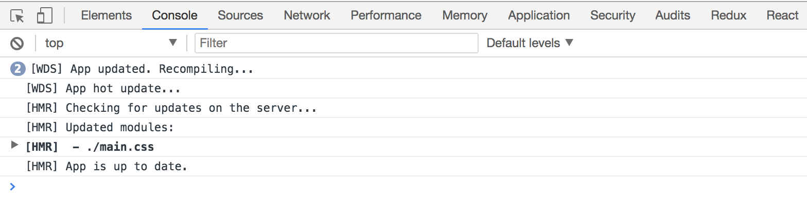

### 开启模块热替换
要做到实时预览，除了在[4-5使用自动刷新](4-5使用自动刷新.md)中介绍的刷新整个网页外，DevServer 还支持一种叫做模块热替换( Hot Module Replacement )的技术可在不刷新整个网页的情况下做到超灵敏的实时预览。
原理是当一个源码发生变化时，只重新编译发生变化的模块，再用新输出的模块替换掉浏览器中对应的老模块。

模块热替换技术的优势有：

- 实时预览反应更快，等待时间更短。
- 不刷新浏览器能保留当前网页的状态，例如在使用 Redux 来管理数据的应用中搭配模块热替换能做到代码更新时 Redux 中的数据还保持不变。

总的来说模块热替换技术很大程度上的提高了开发效率和体验。

#### 模块热替换的原理
模块热替换的原理和自动刷新原理类似，都需要往要开发的网页中注入一个代理客户端用于连接 DevServer 和网页，
不同在于模块热替换独特的模块替换机制。

DevServer 默认不会开启模块热替换模式，要开启该模式，只需在启动时带上参数 `--hot`，完整命令是 `webpack-dev-server --hot`。

> 除了通过在启动时带上 `--hot` 参数，还可以通过接入 Plugin 实现，相关代码如下：
> ```js
> const HotModuleReplacementPlugin = require('webpack/lib/HotModuleReplacementPlugin');
> 
> module.exports = {
>   // ...
>   plugins: [
>     // 该插件的作用就是实现模块热替换，实际上当启动时带上 `--hot` 参数，会注入该插件。
>     new HotModuleReplacementPlugin(),
>   ],
> };
> ```

启动后日志如下：
```
> webpack-dev-server --hot

Project is running at http://localhost:8080/
webpack output is served from /
webpack: wait until bundle finished: /
webpack: wait until bundle finished: /bundle.js
Hash: fe62ac6b753c1d98961b
Version: webpack 3.5.5
Time: 3563ms
        Asset     Size  Chunks                    Chunk Names
    bundle.js  1.11 MB       0  [emitted]  [big]  main
bundle.js.map  1.33 MB       0  [emitted]         main
  [50] (webpack)/hot/log.js 1.04 kB {0} [built]
 [118] multi (webpack)-dev-server/client?http://localhost:8080 webpack/hot/dev-server ./main.js 52 bytes {0} [built]
 [119] (webpack)-dev-server/client?http://localhost:8080 5.83 kB {0} [built]
 [120] ./node_modules/url/url.js 23.3 kB {0} [built]
 [126] ./node_modules/strip-ansi/index.js 161 bytes {0} [built]
 [128] ./node_modules/loglevel/lib/loglevel.js 6.74 kB {0} [built]
 [129] (webpack)-dev-server/client/socket.js 856 bytes {0} [built]
 [161] (webpack)-dev-server/client/overlay.js 3.6 kB {0} [built]
 [166] (webpack)/hot nonrecursive ^\.\/log$ 170 bytes {0} [built]
 [168] (webpack)/hot/dev-server.js 1.61 kB {0} [built]
 [169] (webpack)/hot/log-apply-result.js 1.31 kB {0} [built]
 [170] ./main.js 2.35 kB {0} [built]
    + 262 hidden modules
```
可以看出 `bundle.js` 代理客户端相关的代码包含九个文件：
```
 [119] (webpack)-dev-server/client?http://localhost:8080 5.83 kB {0} [built]
 [120] ./node_modules/url/url.js 23.3 kB {0} [built]
 [126] ./node_modules/strip-ansi/index.js 161 bytes {0} [built]
 [128] ./node_modules/loglevel/lib/loglevel.js 6.74 kB {0} [built] 
 [129] (webpack)-dev-server/client/socket.js 856 bytes {0} [built]
 [161] (webpack)-dev-server/client/overlay.js 3.6 kB {0} [built]
 [166] (webpack)/hot nonrecursive ^\.\/log$ 170 bytes {0} [built]
 [168] (webpack)/hot/dev-server.js 1.61 kB {0} [built]
 [169] (webpack)/hot/log-apply-result.js 1.31 kB {0} [built]
```
相比于自动刷新的代理客户端，多出了后三个用于模块热替换的文件，也就是说代理客户端更大了。

修改源码 `main.css` 文件后，新输出了如下日志：
```
webpack: Compiling...
Hash: 18f81c959118f6230623
Version: webpack 3.5.5
Time: 551ms
                                   Asset       Size  Chunks                    Chunk Names
                               bundle.js    1.11 MB       0  [emitted]  [big]  main
    0.ea11a51f97f2b52bca7d.hot-update.js  353 bytes       0  [emitted]         main
    ea11a51f97f2b52bca7d.hot-update.json   43 bytes          [emitted]         
                           bundle.js.map    1.33 MB       0  [emitted]         main
0.ea11a51f97f2b52bca7d.hot-update.js.map  577 bytes       0  [emitted]         main
  [68] ./node_modules/css-loader!./main.css 217 bytes {0} [built]
 [166] (webpack)/hot nonrecursive ^\.\/log$ 170 bytes {0} [built]
    + 275 hidden modules
webpack: Compiled successfully.
```
DevServer 新生成了一个用于替换老模块的补丁文件 `0.ea11a51f97f2b52bca7d.hot-update.js`，同时在浏览器开发工具中也能看到请求这个补丁的抓包：


可见补丁中包含了 `main.css` 文件新编译出来 CSS 代码，网页中的样式也立刻变成了源码中描述的那样。

但当你修改 `main.js` 文件时，会发现模块热替换没有生效，而是整个页面被刷新了，为什么 `.js` 文件会这样呢？

模块热替换功能为了让使用者灵活的控制老模块被替换时的逻辑，可以在源码中定义一些代码去做相应的处理。

把的 `main.js` 文件改为如下：
```js
import React from 'react';
import { render } from 'react-dom';
import { AppComponent } from './AppComponent';
import './main.css';

render(<AppComponent/>, window.document.getElementById('app'));

// 只有当开启了模块热替换时 module.hot 才存在
if (module.hot) {
  // accept 函数的第一个参数指出当前文件接受哪些子模块的替换，这里表示只接受 ./AppComponent 这个子模块
  // 第二个参数用于在新的子模块加载完毕后需要执行的逻辑
  module.hot.accept(['./AppComponent'], () => {
    // 新的 AppComponent 加载成功后重新执行下组建渲染逻辑
    render(<AppComponent/>, window.document.getElementById('app'));
  });
}
```
其中的 `module.hot` 是当开启模块热替换后注入到全局的 API，用于控制模块热替换的逻辑。

现在修改 `AppComponent.js` 文件，把 `Hello,Webpack` 改成 `Hello,World`，你会发现模块热替换生效了。
但是当你编辑 `main.js` 时，你会发现整个网页被刷新了。为什么修改这两个文件会有不一样的表现呢？

当子模块发生更新时，更新事件会一层层往上传递，也就是从 `AppComponent.js` 文件传递到 `main.js` 文件，
直到有某层的文件接受了当前变化的模块，也就是 `main.js` 文件中定义的 `module.hot.accept(['./AppComponent'], callback)`，
这时就会调用 `callback` 函数去执行自定义逻辑。如果事件一直往上抛到最外层都没有文件接受它，就会直接刷新网页。

那为什么没有地方接受过 `.css` 文件，但是修改所有的 `.css` 文件都会触发模块热替换呢？
原因在于 `style-loader` 会注入用于接受 CSS 的代码。

> 请不要把模块热替换技术用于线上环境，它是专门为提升开发效率生的。

#### 优化模块热替换
在发生模块热替换时，你会在浏览器的控制台中看到类似这样的日志：


其中的 `Updated modules: 68` 是指 ID 为68的模块被替换了，这对开发者来说很不友好，因为开发者不知道 ID 和模块之间的对应关系，最好是把替换了的模块的名称输出出来。
Webpack 内置的 [NamedModulesPlugin]() 插件可以解决该问题，修改 Webpack 配置文件接入该插件：
```js
const NamedModulesPlugin = require('webpack/lib/NamedModulesPlugin');

module.exports = {
  plugins: [
    // 显示出被替换模块的名称
    new NamedModulesPlugin(),
  ],
};
```
重启构建后你会发现浏览器中的日志更加友好了：



除此之外，模块热替换还面临着和自动刷新一样的性能问题，因为它们都需要监听文件变化和注入客户端。
要优化模块热替换的构建性能，思路和在[4-5 使用自动刷新](4-5使用自动刷新.md)中提到的以下两点很类似：

- 监听更少的文件，忽略掉 `node_modules` 目录下的文件。
- 关闭默认的 inline 模式，手动注入代理客户端。

但在手动注入代理客户端时有些区别，原因在于代理客户端中需要包含实现替换模块相关的代码，
在[4-5 使用自动刷新](4-5使用自动刷新.md)中提到的 DevServer 提供的代理客户端脚本 `http://localhost:8080/webpack-dev-server.js` 中不包含这部分代码。

